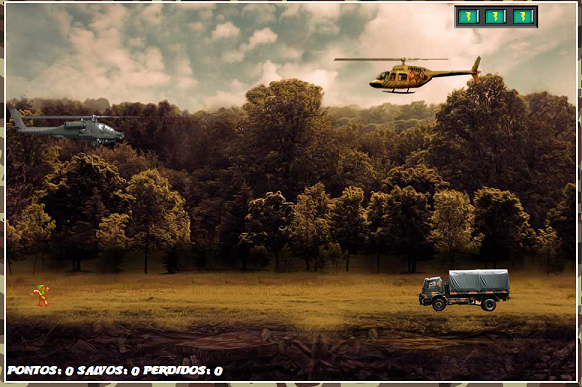
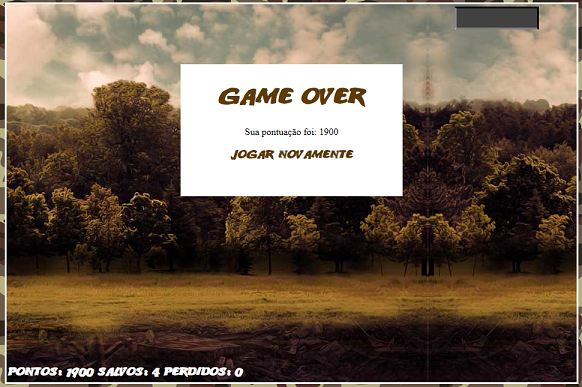

# Spaceship Game
Código apresentado no Lab **"Construindo o seu primeiro jogo de naves"** da [Digital Innovation One](https://digitalinnovation.one).

## Instruções
Para iniciar o jogo, abra o `index.html` no seu navegador da web.

Use as teclas 'w' e 's' para mover verticalmente o helicóptero e a tecla 'd' para efetuar disparos. Salve seus companheiros levando o helicóptero até eles e destrua os inimigos para ganhar pontos.

## Tecnologias utilizadas
- HTML
- CSS
- Javascript

## Screenshots

